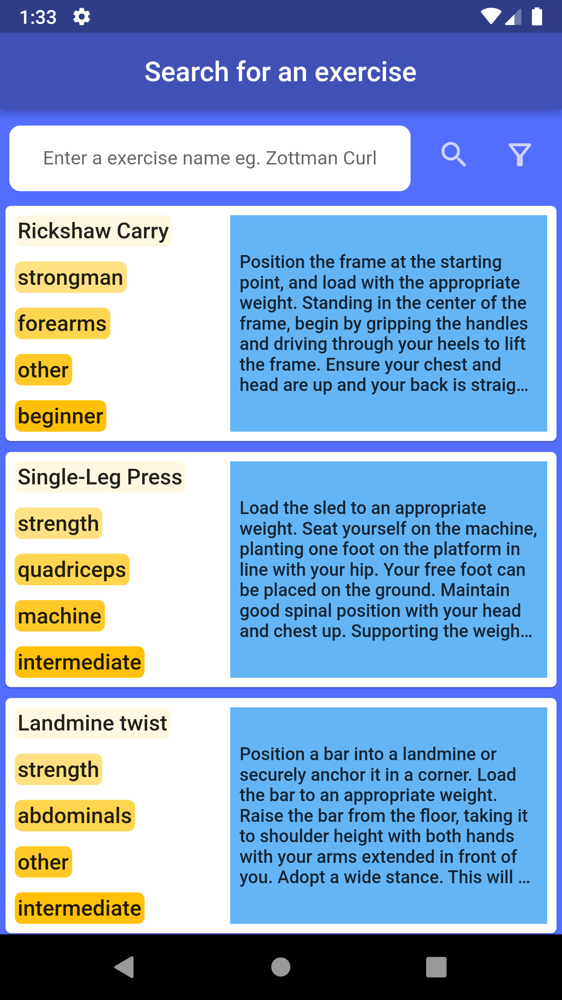

# study_case_task

This is an mobile app which search exercises by filter feature. Also built via Flutter.

Architecture : MVVM.

Packages :   
dio: ^4.0.6
provider: ^6.0.4

---ScreenShots and other Media---

  |    |
  |    |

## Getting Started

This project is a starting point for a Flutter application.

A few resources to get you started if this is your first Flutter project:

- [Lab: Write your first Flutter app](https://docs.flutter.dev/get-started/codelab)
- [Cookbook: Useful Flutter samples](https://docs.flutter.dev/cookbook)

For help getting started with Flutter development, view the
[online documentation](https://docs.flutter.dev/), which offers tutorials,
samples, guidance on mobile development, and a full API reference.
